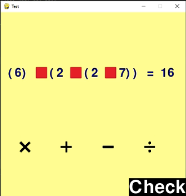

# Operation Guesser 

The operation guesser is a project inspired by the PyJac competition. 
The project receives a sequence of numbers, a target value, and returns
a string  representing the arithmetic operations required to
form the target.

## Examples

```
>>> solve((1, 2, 3, 4), 10)
1 + 2 + 3 + 4
>>> solve((10, 20, 5), 6)
(20 + 10) / 5
```
You may run `consoleSolver.py` to experiment
with the program's output in different scenrios. 


## User Interface



## Dependencies

The project require python 3,
as well as pygame.
You can `pip install pygame`. 
